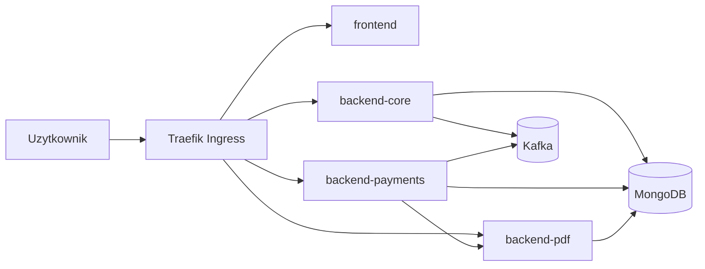

# SprawdzSluch - Przewodnik Aplikacji i Uruchomienia

Ten dokument opisuje jak rozumiec architekture, jak uruchomic projekt lokalnie i jak wykonac checkliste przed commitem.

## Cel projektu

SprawdzSluch to system do obslugi testow sluchu z podzialem na mikroserwisy. Frontend jest wystawiony przez Traefik, backendy zapisują dane w MongoDB, a elementy platnosci i raportowania sa rozdzielone na osobne uslugi.

## Architektura

### Mikroserwisy

1. `frontend` (Nginx + statyczny build)
2. `backend-core` (Spring Boot)
3. `backend-payments` (Spring Boot)
4. `backend-pdf` (Node.js/Express)

### Infrastruktura

1. `mongodb` (StatefulSet)
2. `kafka` (StatefulSet)
3. `traefik` (Ingress Controller)
4. `mongo-express`, `kafka-ui` (narzedzia pomocnicze)

### Przeplyw ruchu



## Routing HTTP (istotne)

1. Frontend: `/`
2. Core natywnie: `/api/results`
3. Core alias: `/api/hearing-test` -> rewrite do `/api/results`
4. Payments natywnie: `/api/payments`
5. Payments alias: `/api/v1/payments` -> rewrite do `/api/payments`
6. PDF: `/api/v1/pdf`, `/api/v1/email`, `/health`

Uwaga: `backend-payments` ma kontroler pod `/api/payments`, dlatego alias v1 jest obslugiwany przez middleware w Traefiku.

## Szybki start lokalny

### Wymagania

1. `docker`
2. `kubectl`
3. `kind`
4. `helm`

### One-command start

```bash
./scripts/local-up.sh
```

Skrypt:
1. tworzy (lub uzywa) klastra `kind-sprawdzsluch-local`,
2. instaluje Traefika,
3. buduje obrazy (chyba ze `--skip-build`),
4. laduje obrazy do kind,
5. aplikuje manifesty K8s,
6. czeka na rollout,
7. uruchamia smoke test (chyba ze `--skip-smoke`).

### Przydatne warianty

```bash
# bez rebuildu obrazow
./scripts/local-up.sh --skip-build

# bez smoke testu
./scripts/local-up.sh --skip-smoke

# sam smoke test
./scripts/local-smoke.sh
```

## Checklista przed commitem

Wykonaj po kazdej zmianie funkcjonalnej lub infrastrukturalnej.

1. Start środowiska lokalnego
  - `./scripts/local-up.sh --skip-build`
2. Stan podow
  - `kubectl get pods -n sprawdzsluch`
  - oczekiwane: wszystkie `Running` i `READY 1/1`
3. Smoke test automatyczny
  - `./scripts/local-smoke.sh`
4. Manual API sanity
  - `curl -i http://127.0.0.1:8080/`
  - `curl -i http://127.0.0.1:8080/health`
  - `curl -i -X POST http://127.0.0.1:8080/api/payments/process -H 'Content-Type: application/json' -d '{"testId":"manual-check","paymentMethod":"VOUCHER","voucherCode":"TEST123"}'`
5. Brak krytycznych bledow runtime
  - `kubectl logs -n sprawdzsluch deployment/backend-core --tail=120`
  - `kubectl logs -n sprawdzsluch deployment/backend-payments --tail=120`
  - `kubectl logs -n sprawdzsluch deployment/backend-pdf --tail=120`
6. Weryfikacja zmian git
  - `git status --short`
  - sprawdz czy commit nie zawiera przypadkowych plikow tymczasowych

## Operacyjny flow pracy (zalecany)

1. Zmien kod/manifests.
2. Uruchom `./scripts/local-up.sh --skip-build`.
3. Jesli zmieniales backend/frontend obraz, odpal bez `--skip-build`.
4. Uruchom `./scripts/local-smoke.sh`.
5. Dopiero po zielonej walidacji rob commit i push.

## Typowe problemy i szybkie fixy

### 1. `CrashLoopBackOff` na `backend-pdf`

1. Sprawdz logi: `kubectl logs -n sprawdzsluch deployment/backend-pdf --tail=200`
2. Przebuduj obraz: `docker build -t localhost:5000/backend-pdf:latest ./backend-pdf`
3. Zaladuj do kind: `kind load docker-image localhost:5000/backend-pdf:latest --name sprawdzsluch-local`
4. Restart deploy: `kubectl rollout restart deployment/backend-pdf -n sprawdzsluch`

### 2. Kafka `Pending` przez PVC

1. Upewnij sie, ze `storageClassName` to `standard` w `k8s/kafka/kafka-statefulset.yaml`.
2. Usun stary PVC i pozwol K8s utworzyc nowy:

```bash
kubectl delete pvc kafka-data-kafka-0 -n sprawdzsluch --ignore-not-found=true
```

### 3. 504/503 przez Ingress

1. Sprawdz czy Traefik dziala: `kubectl get pods -n traefik`
2. Sprawdz NetworkPolicy dla `backend-payments` i `backend-pdf` (namespace `traefik` musi byc dopuszczony).
3. Sprawdz endpointy przez port-forward Traefika:

```bash
kubectl port-forward -n traefik svc/traefik 8080:80
```

## Pliki kluczowe

1. Start lokalny: `scripts/local-up.sh`
2. Smoke test: `scripts/local-smoke.sh`
3. Routing ingress: `k8s/ingress.yaml`
4. NetworkPolicy payments: `k8s/backend-payments/service.yaml`
5. NetworkPolicy pdf: `k8s/backend-pdf/service.yaml`
6. Kafka storage class: `k8s/kafka/kafka-statefulset.yaml`

## Uwaga o commitach

Aktualny zalecany proces w tym repo: najpierw lokalna walidacja (`local-up` + `local-smoke`), dopiero potem commit i push.
